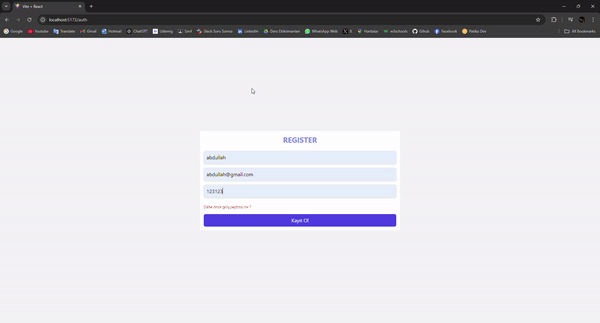

# DESCRIPTION

- This project is a MERN (MongoDB, Express.js, React-Redux, Node.js) stack-based post sharing application. Users can log in and log out based on tokens. If already registered, they will receive a notification. Users can create, delete, and update posts.

`To run the Server: 'nodemon index.js'`

`To run the Client: type 'npm run dev'`

# BACKEND TECHNOLOGIES

- nodemon, express, MongoDB, Node.js, jsonwebtoken, bodyparser, dotenv

# FRONTEND TECHNOLOGIES

- tailwind, react-router-dom, react-toastify, react-redux, redux-thunk, axios , react-icons

# PROJECT GIF

